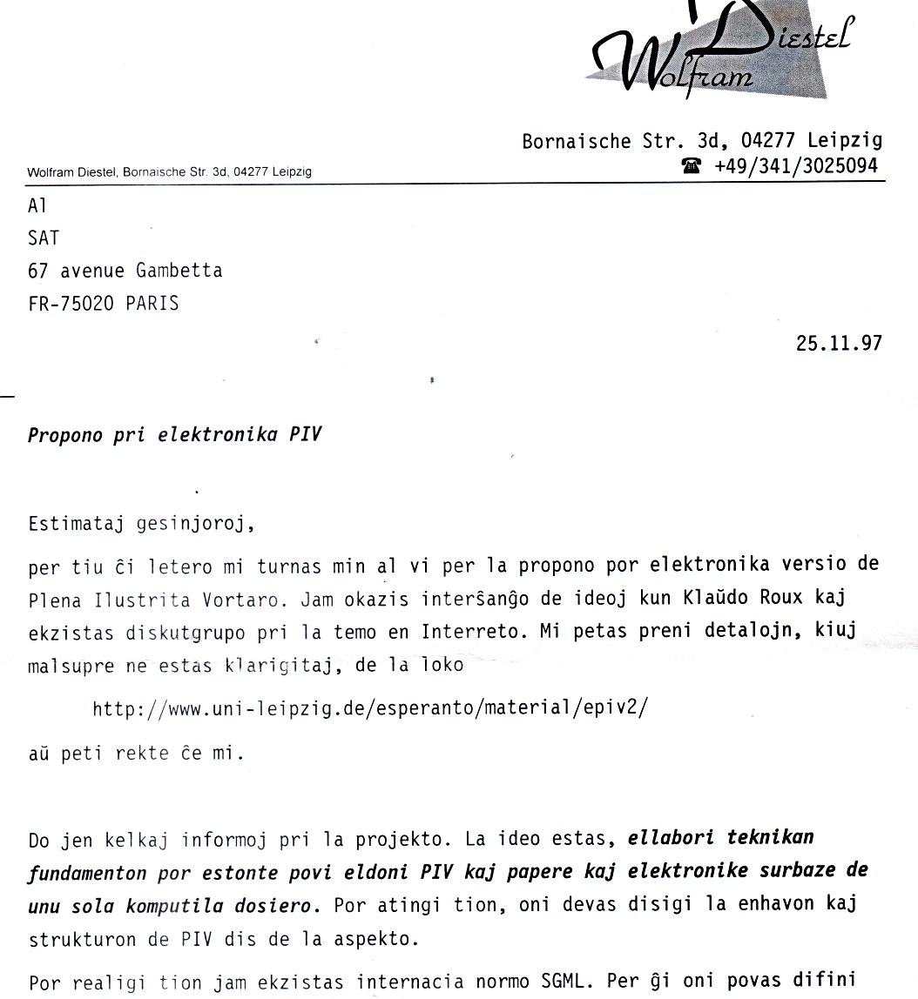
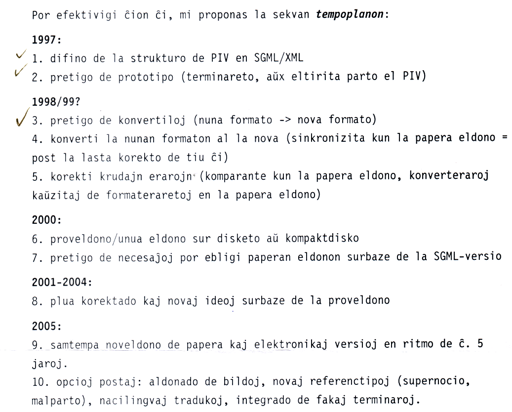
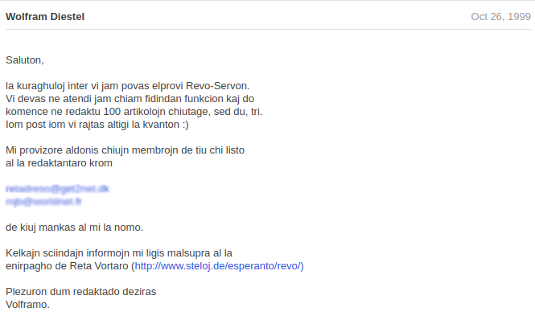
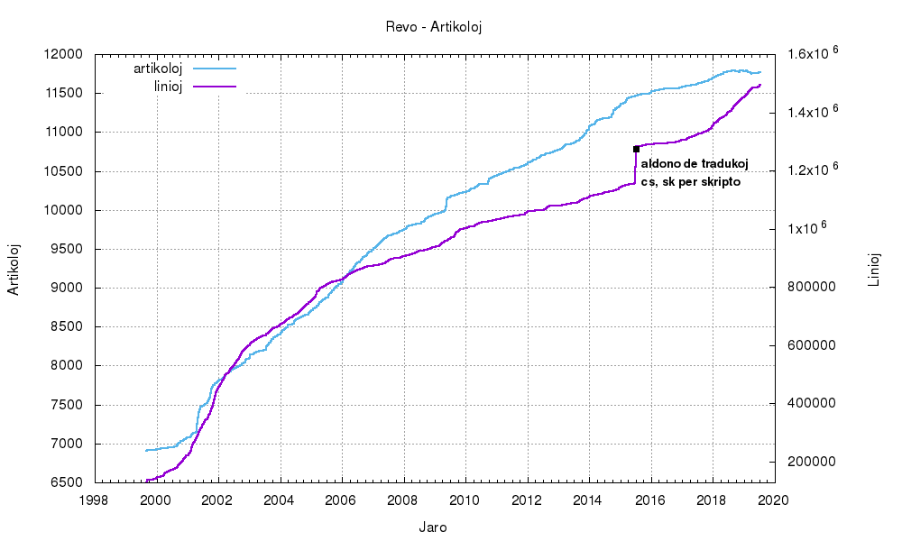
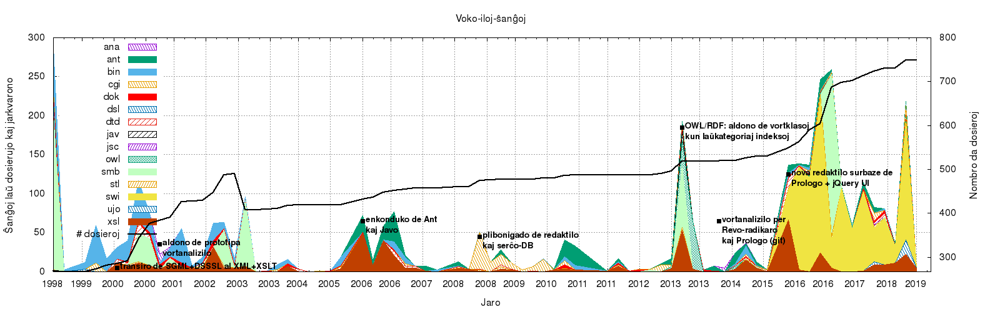

{: style="float: right; margin-left: 2em; max-width: 25%; border: 0"}

* Enhavo
{:toc}

 

## Fondiĝo de la projekto

Dum laborado pri [*Michael Ende*: "La Senĉesa Rakonto"](https://eo.wikipedia.org/wiki/La_sen%C4%89esa_rakonto), al la tradukanto mankis facile konsultebla vortaro de Esperanto.

### MCMXCVII

Post la eldono de la romano en 1997 -- denove libera por komenci novan projekton -- formiĝis plano por krei komputilan vortaron. La origina ideo estis prepari Plenan Ilustritan Vortaron en taŭga formo por eldono sur lumdisko.

| Aŭgusto 1997 | Diskutoj kun Klaŭdo Roux kaj Edmund Grimley Evans pri ebleco elektronikigi PIVon. Solvo surbaze de XML/SGML ŝajnis plej taŭga pro la komplika strukturo de la PIVaj artikoloj. XML tiam estis ankoraŭ ne normita, sed ŝajnis bona kandidato |
| Aŭtuno 1997 | Unuaj eksperimentoj per XML, SGML poste ankaŭ DSSSL (Jade) |
| Novembro 1997 | Preparo de terminareto per XML kaj propono al SAT |

Jen eltiraĵoj el la letero al SAT en Novembro 1997 (tiutempe oni uzis ordinare ankoraŭ paperajn leterojn por skriba komunikado).

... 

... (detaligoj sur kelkaj pliaj paĝoj) ...

La retpaĝo menciita en la letero kun detalaj klarigoj ankoraŭ
[troviĝas en la Interretarĥivo](https://web.archive.org/web/19990429174525/http://www.uni-leipzig.de/esperanto/material/epiv2/index.html). 

### MCMXCVIII

En Februaro 1998 SAT sur tri disketoj provizis specimenajn nereviziitajn artikolojn de PIV en formato *MS Word*. Dum la sekvaj monatoj estiĝis [dokumenttipdifino (DTD)](https://sourceforge.net/p/retavortaro/code/HEAD/tree/branches/voko/dtd/vokosgml.dtd), [konvertoskripto al SGML verkita en la lingvo Perlo](https://sourceforge.net/p/retavortaro/code/HEAD/tree/branches/voko/bin/piv2vkl.pl) kaj 
[transformskriptoj en la lingvo DSSSL](https://sourceforge.net/p/retavortaro/code/HEAD/tree/branches/voko/dsl/) por prepari la artikolojn kaj indeksojn kiel HTML.

Post pretigo de *pruvo de la koncepto*, fine de 1998 ĉio sendiĝis lumdiske al SAT, kiu en kunsido diskutis la aferon kaj revenis kun ... *nedecido*! Laŭ klarigoj de ĉeestanto kelkaj progresemaj kunsidantoj ne povis konvinki pliopon da konservemuloj, kiuj timis perdon de kontrolo kaj enspezoj de PIV per elektronika publikigo.

### MCMXCIX

La volo pri komputile konsultebla vortaro persistis, kaj do kiel komenco de ĉirkaŭvojo ĝis somero 1999 estiĝis Reta Vortaro surbaze de la ellaboritaj teĥnikaj rimedoj kaj la enhavo de publike haveblaj vortaroj kiel Plena Vortaro kaj traduklistoj. 
Ĝis Oktobro aldoniĝis ankaŭ la ebleco sendi ŝanĝojn per retpoŝto kaj iom poste ankaŭ retformularo. Intertempe okazis ankaŭ transiro de SGML al la lastatempe normigita XML, nelaste pro bezonata Unikodo...
La [rezultopaĝo de Oktobro 1999](https://web.archive.org/web/19991007003636/http://www.uni-leipzig.de/esperanto/material/epiv2/docu/rezultoj.html) pli detalas ĉion ĉi.

|    Septembro 1999 | Publikigo de unua kruda versio en Interreto. |
|    Aŭtuno 1999    | Eksperimentado pri redakteblecoj rekte per CGI-programoj. |
|    Oktobro 1999   | Lanĉo de dissendolisto revo@onelist.com por interesitoj pri ReVo. Rezigo pri CGI-redaktado pro malfacileco realigi tion sufiĉe sekurece. Programado de retpoŝta servo por la traktado de redaktitaj artikoloj. |
|   Fine de Oktobro | Unua versio de retpoŝta redaktoservo ekfunkcias. De tiam manpleno da diligentaj redaktantoj aldonas nacilingvajn tradukojn  (germana, turka, itala, franca) kaj prilaboras fakojn (botaniko, zoologio, kuirarto).  Krome daŭra plibonigado de la iloj. |

Jen la anonco en la projekta diskutforumo pri redaktebla Revo en Oktobro 1999:

.

### MM

|    Marto 2000 | Programeto por retrovi la fontojn de citaĵo kreiĝis kaj do citaĵoj ricevos ekzaktajn fontindikojn |
|    Paske 2000 | Prelego pri Revo okaze de PSI. Realigo de DICT-versio de la vortaro. |
|    Somero 2000 | Iom post iom aliĝas redaktantoj pri nederlanda, rusa, hispana, itala, franca, komputiko, matematiko. Kaj aldoniĝas bildoj de plantoj kaj bestoj. Realiĝas tezaŭro, tio necesigas ankaŭ novaranĝon de la indeksoj, kiuj nun estas sur kvar paĝoj Eo, lingvoj, fakoj, ktp. Plue tre kontinua evoluado de la enhavo, rearanĝo de la tezaŭro de arba al noda prezento. |

Se vi volas rigardi, kiel aspektis tiama Revo, vi povas konsulti la (nur parte navigeblan)
[arĥivitan version de Aŭgusto 2000](https://web.archive.org/web/20000819043436/http://www.uni-leipzig.de/esperanto/voko/revo/).

## Evoluo de la artikoloj MM -- MMXX

Kiel montras la malsupra statistiko, ene de dudek jaroj la nombro de artikoloj preskaŭ duobliĝis kaj
averaĝa artikolofonto pli ampleksiĝis de 40 al 150 linioj, alivorte la enhavo ampleksiĝis je sesoblo.

## Evoluo de la kodo

Ankaŭ la kodo 
abunde evoluiĝis dum tiu tempo, kiel ilustras tiu ĉi montareto farita
el [la kodarĥivo](https://sourceforge.net/projects/retavortaro/) uzata antaŭ la transiro al 
[*Github*](https://github.com/revuloj).

La staton de la [kodo de Novembro 1998](https://sourceforge.net/p/retavortaro/code/HEAD/tree/branches/voko/)
oni povas ankoraŭ rigardi.

La vortaro estas plurlingva ne nur por la uzantoj, sed ankaŭ por la programintoj: 
ĝis nun uziĝis pli ol dekduo da lingvoj.

|ekde | Kodlingvoj |
|:----|:-----------|
|1997 | praa Revo: Perlo, SGML, DSSSL, HTML|
|1999 | Revo: Perlo, XML, XSLT, HTML, CSS|
|2003 | Serĉilo kaj redakt-formularo: Perlo, Javoskripto, SQL (Wieland Pusch)|
|2006 | Nova transformilo: Ant, Javo, XML, XSLT|
|2014 | Prevo por Androido: Javo (Neil Roberts)|
|2015 | Vortanalizilo: Prologo|
|2016 | PoŝRevo por iOS: Swift, Ruby (Robin Hill)|
|2017 | Nova redaktilo: Prologo + Javoskripto|

