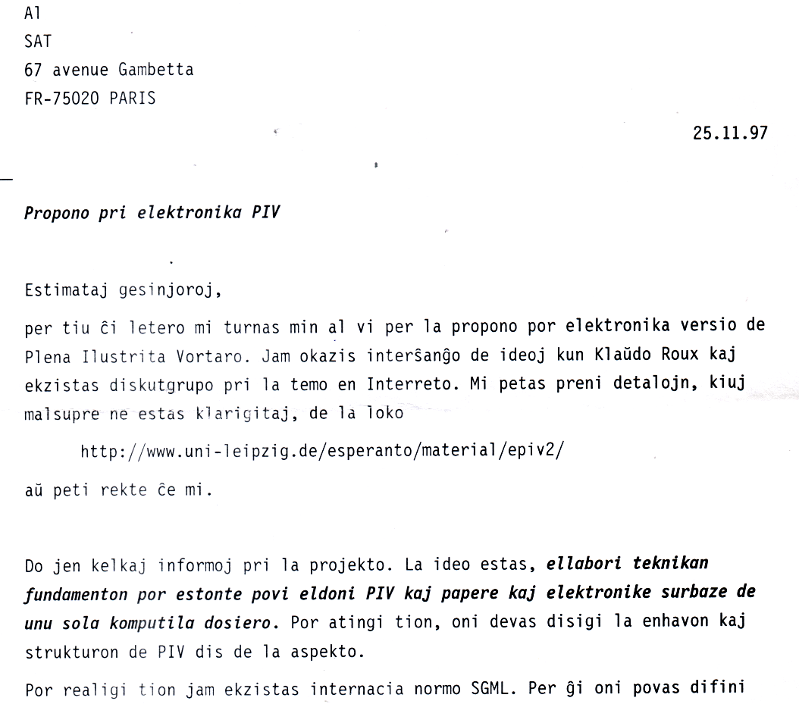

{: style="float: left; margin-left: -1em; margin-top: -1em; margin-right: 2em; max-width: 15%; border: 0"}

* Enhavo
{:toc}

 

## Fondiĝo de la projekto

Dum laborado pri la traduko de [*Michael Ende*: "La Senĉesa Rakonto"](https://eo.wikipedia.org/wiki/La_sen%C4%89esa_rakonto), al la tradukanto mankis facile konsultebla komputila vortaro de Esperanto. Post la eldono de la romano en 1997 -- denove libera por komenci novan projekton -- formiĝis plano por krei elektronikan vortaron. La origina ideo estis prepari Plenan Ilustritan Vortaron en taŭga formo por eldono sur lumdisko.

Jen eltiraĵoj el la letero al SAT en Novembro 1997 (tiutempe oni uzis ordinare ankoraŭ paperajn leterojn por skriba komunikado).

... 

... (detaligoj sur kelkaj pliaj paĝoj) ...

La retpaĝo menciita en la letero kun detalaj klarigoj ankoraŭ
[troviĝas en la Interretarĥivo](https://web.archive.org/web/19990429174525/http://www.uni-leipzig.de/esperanto/material/epiv2/index.html). 

En Februaro 1998 SAT sur tri disketoj provizis specimenajn nereviziitajn artikolojn de PIV en formato *MS Word*. Dum la sekvaj monatoj estiĝis [dokumenttipdifino (DTD)](https://sourceforge.net/p/retavortaro/code/HEAD/tree/branches/voko/dtd/vokosgml.dtd), [konvertoskripto al SGML verkita en la lingvo Perlo](https://sourceforge.net/p/retavortaro/code/HEAD/tree/branches/voko/bin/piv2vkl.pl) kaj 
[transformskriptoj en la lingvo DSSSL](https://sourceforge.net/p/retavortaro/code/HEAD/tree/branches/voko/dsl/) por prepari la artikolojn kaj indeksojn kiel HTML.

Post pretigo de *pruvo de la koncepto*, tiu sendiĝis al SAT, kiu en kunsido diskutis la aferon kaj revenis kun ... *nedecido*! Laŭ klarigoj de ĉeestanto kelkaj progresemaj kunsidantoj ne povis konvinki pliopon da konservemuloj, kiuj timis perdon de kontrolo kaj enspezoj de PIV per elektronika publikigo.

La volo pri komputile konsultebla vortaro persistis, kaj do kiel komenco de ĉirkaŭvojo ĝis somero 1999 estiĝis Reta Vortaro surbaze de la ellaboritaj teĥnikaj rimedoj kaj la enhavo de Plena Vortaro. Ĝis Oktobro aldoniĝis ankaŭ la ebleco sendi ŝanĝojn per retpoŝto kaj iom poste ankaŭ retformularo. Intertempe okazis ankaŭ transiro de SGML al la lastatempe normigita XML...
La [rezultopaĝo de Oktobro 1999](https://web.archive.org/web/19991007003636/http://www.uni-leipzig.de/esperanto/material/epiv2/docu/rezultoj.html) pli detalas ĉion ĉi.

Jen la anonco en la projekta diskutforumo pri redaktebla Revo en Oktobro 1999:

.

Se vi volas rigardi, kiel aspektis tiama Revo, vi povas konsulti la (nur parte navigeblan)
[arĥivitan version de Aŭgusto 2000](https://web.archive.org/web/20000819043436/http://www.uni-leipzig.de/esperanto/voko/revo/).

## Evoluo de la artikoloj dum du jardekoj

Kiel montras la malsupra statistiko, ene de dudek jaroj la nombro de artikoloj preskaŭ duobliĝis kaj
averaĝa artikolofonto pli ampleksiĝis de 40 al 150 linioj, alivorte la enhavo ampleksiĝis je sesoblo.

## Evoluo de la kodo dum du jardekoj

Ankaŭ la kodo 
abunde evoluiĝis dum tiu tempo, kiel ilustras tiu ĉi montareto farita
el [la kodarĥivo](https://sourceforge.net/projects/retavortaro/) uzata antaŭ la transiro al 
[*Github*](https://github.com/revuloj).

La staton de la [kodo de Novembro 1998](https://sourceforge.net/p/retavortaro/code/HEAD/tree/branches/voko/)
oni povas ankoraŭ rigardi en la [kodarĥivo](https://sourceforge.net/p/retavortaro/code/).

La vortaro estas plurlingva ne nur por la uzantoj, sed ankaŭ por la programintoj: ĝis nun necesis pli ol dekduo da lingvoj.

|ekde | Kodlingvoj |
|:----|:-----------|
|1997 | praa Revo: Perlo, SGML, DSSSL, HTML|
|1999 | Revo: Perlo, XML, XSLT, HTML, CSS|
|2003 | Serĉilo kaj redakt-formularo: Perlo, Javoskripto, SQL (Wieland Pusch)|
|2006 | Nova transformilo: Ant, Javo, XML, XSLT|
|2014 | Prevo por Androido: Javo (Neil Roberts)|
|2015 | Vortanalizilo: Prologo|
|2016 | PoŝRevo por iOS: Swift, Ruby (Robin Hill)|
|2017 | Nova redaktilo: Prologo + Javoskripto|

