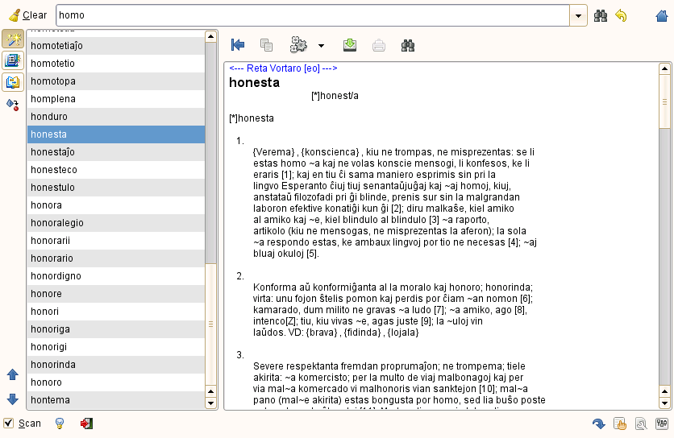

{: style="float: left; margin-right: 2em; max-width: 50%; border: solid gray 1px"}

* Enhavo
{:toc}

 

## Interrete

Plej facile vi uzas la vortaron per moderna retumilo kiel Internet Explorer, Firefox, Safari k.a. rekte sur la hejmpaĝo <a target="_new" href="http://purl.org/net/voko/revo/">http://purl.org/net/voko/revo</a>.

Se vi volas uzi ĝin sen kadroj, ekz. per lynx vi komencu ĉe la adreso
<a target="_new" href="http://purl.org/net/voko/revo/inx/_plena.html">http://purl.org/net/voko/revo/inx/_plena.html</a>.

Alternativa ebleco estas uzi per DICT-kliento.
<a target="_new" href="http://www.dict.org/">DICT</a> estas interreta protokolo speciale kreita por vortaroj. En la reto estas pluraj serviloj, kiuj servas vortarojn per tiu protokolo kaj estas uzeblaj tra la reto per DICT-kliento.

Bedaŭrinde la publikaj DICT-servoj por Revo nuntempe ne funkcias, 
sed se estas bezono certe estas ebleco reaktivi tian servon:

- dict.antono.info:2628 (Antono Vasiljev)
- dict.dnp.fmph.uniba.sk:2628 (Radovan Garabik)

Sed vi povas instali tian servon ankaŭ loke en via sistemo. Pluraj Linuksoj jam havas pretajn pakaĵojn.

## Androido

Estas pluraj eblecoj uzi Revon en Androido:

- <a target="_new" href="https://play.google.com/store/apps/details?id=uk.co.busydoingnothing.prevo">PRevo ĉe Google play</a> de Neil Roberts.
- <a target="_new" href="https://play.google.com/store/apps/details?id=com.esperantajvortaroj.app">Praktika Vortaro</a> de Dušan Juretić.
- <a target="_new" href="http://dodoburgers.com/eo/">Versio kompilita</a> de Cillian de Róiste por <a target="_new" href="http://aarddict.org/">aarddict</a>, uzebla kun FBReader.
- La vortaro-programo <a target="_new" href="http://goldendict.org">GoldenDict</a> aŭ <a target="_new" href="https://play.google.com/store/apps/details?id=com.socialnmobile.colordict&amp;hl=en">ColorDict</a> por poŝkomputiloj kun Android-sistemo uzante la <a href="https://github.com/muravjov/vkompililo#eo-kiel-instali-revo-en-telefonon-kun-android">(Star-)DICT-formaton</a>. 

## iPhone, iPad, iPod touch

Plej bone uzu la 
<a target="_new" href="http://www.inthescales.com/resources/projects/poshrevo/screenshots/poshrevo_2.jpeg">aplikaĵeton</a> de 
<a target="_new" href="https://github.com/inthescales/PoshReVo">Robin Hill (ĉe Github)</a>.

Ĉar Kobo ankaŭ havas aplikaĵon por iOS eble vi povas ankaŭ [uzi
la version por Kobo](#kobo). Mi ankoraŭe ne elprovis, ĉu funkcias.

Vidu sub [OPF/EPUB/MOBI](#opf--epub--kaj-mobi-formato) pri alia ebleco uzante legprogramojn por OPF/MOBI (iBooks App, Kindle App). La programo iBooks cetere estas iom malrapida, do tuta Revo verŝajne estus tro peza por ĝi, eltiraĵo certe eblas. 

## Stardict

Per la programo `dictd2dic` vi povas krei vortaron por
<a target="_new" href="http://stardict.sf.net">StarDict</a> el la datumbazo por DICT-servo. Stardict estas uzebla en Vindozo, Makintoŝo kaj Linuksoj sambone.

Por uzado el komandlinio ekzistas ankaŭ programo `sdcv`.

## GoldenDict

<a target="_new" href="http://goldendict.org">GoldenDict</a> estas pluevoluo de ne plu flegata StarDict kaj kapablas legi kaj ties formaton kaj dosierojn en la formato de DICT. Pli oportune tamen ŝajnas la interŝanĝformato XDXF.

Ni do nun regule eldonas <a href="https://github.com/revuloj/revo-fonto/releases/">Revo-dosieron en formato XDXF</a>, kiun GoldenDict bone povas importi.

GoldenDict ankaŭ ofertas version por poŝkomputiloj kun Android-sistemo.
Vidu detalajn infromojn de <a target="_new" href="https://github.com/muravjov/vkompililo#eo-kiel-instali-revo-en-telefonon-kun-android">Ilja Muravjov</a>

## loka DICT-servo

Vi povas instali DICT-servon en via komputilo kaj uzi ĝin per DICT-kliento.
Por Debian kaj Ubuntu Antono Vasiljev preparis tujinstaleblan pakaĵon kun Revo. Vidu ĉe 
<a target="_new" href="http://antono.info/epo/2010/05/revo-debian-ubuntu">http://antono.info/epo/2010/05/revo-debian-ubuntu</a> pri detaloj.

## bedic
Vi povas uzi ĝin en la bedic-formato kun la programo 
<a target="_new" href="http://bedic.sourceforge.net/">qbedic</a>. Tiu programo bezonas la fenestrobibliotekon QT kaj estas havebla almenaŭ por Uniksaj sistemoj. Sed ŝajnas, ke qbedic mem ne plu estas flegata, sed nur la versio zbedic por OPIE-bazitaj poŝkomputiloj. 

<!-- <h2 id="posxo">Poŝkomputiloj -->

## TomeRaider

Sergio Pokrovskij proponis version por TomeRaider, kiu estas havebla por diversaj sistemoj:
Pocket PC, PalmOS, EPOC/Symbian_OS kaj MS Windows, intertempe ankaŭ por Android.

Jen <a target="_new" href="http://tech.groups.yahoo.com/group/revuloj/message/5681">diskuto</a>
pri la temo.

## OPF-, EPUB- kaj MOBI-formato

Oni povas uzi la [programon de Dušan Juretić](https://github.com/djuretic/revo-en-kindle/) por krei Revon en formato OPF, el kiu same kiel el EPUB per `kindlegen` eblas traduke pretigi MOBI-dosieron, kiun oni povas uzi ekz-e kiel vortaro en la legoaparato aŭ la lego-apo Kindlo kaj iuj poŝkomputiloj. Ĉe la stokejo de
Dušan vi povas elŝuti pretan [MOBI-dosieron](https://github.com/djuretic/revo-en-kindle/releases).

## OPIE (Linux/QT embedded)

Por tiu ekzistas la programo <a target="_new" href="http://bedic.sourceforge.net/">zbedic</a>, kiu povas uzi la vortaron en la bedic-formato. Komforte estas la funkcio, kiu permesas rekte rigardi en la vortaron klakante vorton ekz. en OpieReader (QTReader) legante tekston.

## Palm webOS

Por Palm Pre ekzistas bele aranĝita
<a target="_new" href="http://www.busydoingnothing.co.uk/prevo/">versio de Neil Robert</a>.

## Kobo

Por la elektronika librolegilo Kobo ekzistas antaŭpreparita 
<a target="_new" href="https://bitbucket.org/marko31/konvertado-de-revo/wiki/Home">versio de
Marco Aurélio</a>.

  Kobo disponigas ankaŭ lego-aplikaĵojn por
   BlackBerry OS, Apple iOS kaj Androido.
